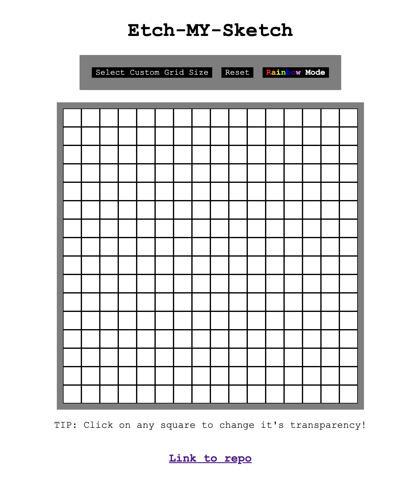

# etch-a-sketch

Web Based etch-a-sketch

Try it here: https://isaacfhu.github.io/etch-a-sketch/

Hi ! I started working on this as part of Odin Project's Foundations Curriculum. This one specifically is the Etch-A-Sketch part (https://www.theodinproject.com/lessons/foundations-etch-a-sketch) but I then decided to continue playing around with it and polish it.

This project was also made during Macondo's Hackclub period and so I made my journals there! My Journals on it : https://macondo.hackclub.com/projects/9530

